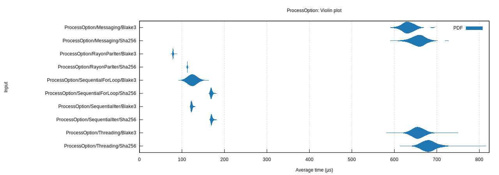

# About

File hash checker represents a minimal solution meeting the following
requirements:

* Calculate the BLAKE3, SHA256, and/or SHA512 hashes of one or more files in
  sequence (for loop, iterator) or parallel (threading, messaging, [`rayon`]
  parallel iterator)
* Provide library API
* Benchmarks via [`criterion`]
* Minimal dependencies: [`blake3`], [`sha2`], [`anyhow`], [`clap`], [`rayon`]
* Provide a CLI utiility:
    * Simpler and more straightforward usage than `sha256sum`, `b3sum`
    * Save the hash to an adjacent hash file (if it doesn't already exist)
      (`.sha256`, `.sha512`, `.b3`)
    * Compare the current hash to an adjacent hash file (if it exists)

[`anyhow`]: https://crates.io/crates/anyhow
[`blake3`]: https://crates.io/crates/blake3
[`clap`]: https://crates.io/crates/clap
[`criterion`]: https://crates.io/crates/criterion
[`sha2`]: https://crates.io/crates/sha2
[`rayon`]: https://crates.io/crates/rayon

# Usage

```
$ fhc -h
File hash checker (BLAKE3, SHA256, SHA512)

Usage: fhc [OPTIONS] [FILES]...

Arguments:
  [FILES]...  File(s)

Options:
  -a <ALGORITHM>           Algorithm [default: blake3] [possible values: blake3,
                           sha256, sha512, blake3-sha256, blake3-sha512,
                           sha256-sha512, all]
  -p, --process <PROCESS>  Approach for processing multiple files [default:
                           rayon-par-iter] [possible values: rayon-par-iter,
                           sequential-for-loop, sequential-iter, threading,
                           messaging]
  -h, --help               Print help
  -V, --version            Print version
```

```
$ fhc -V
fhc 0.11.3
```

# Example

1. Run `fhc` against one or more files to calculate and print the SHA256 or
   BLAKE3 hash for each file to stdout and save in adjacent hash files.
2. At any later point, run `fhc` against one or more files with adjacent
   hash files to re-calculate the hash for each file and report `OK` if the
   hashes match and `FAILED` if the hashes do not match.

# Benchmark




# Changelog

* 0.1.0 (2020-02-03): Initial release
* 0.2.1 (2020-02-09): Produce `.sha256` files compatible w/ `sha256sum -c`
* 0.2.2 (2020-11-18): Update sha2 crate version
* 0.3.0 (2024-01-07): Modernize
* 0.4.0 (2024-01-24): Rename `sequential` process option to `sequentialforloop`; add `sequentialiter` and `rayonpariter` process options; move most of process option logic from CLI to library via process option functions and the process option `run` method; add [`criterion`] benchmarks; fix changelog; update dependencies
    * 0.4.1 (2024-01-24): Fix readme
    * 0.4.2 (2024-01-24): Fix changelog
* 0.5.0 (2024-01-24): Add [`blake3`] and `-a` option
    * 0.5.1 (2024-01-24): Fix readme
    * 0.5.2 (2024-01-25): Fix doc
    * 0.5.3 (2024-01-25): Fix readme
* 0.6.0 (2024-01-25): Change CLI defaults to `-a blake3` and `-p rayon-par-iter`
* 0.7.0 (2024-07-26): Print help if zero files; fix makefile; update dependencies
    * 0.7.1 (2024-08-16): Fix makefile; fix changelog; fix readme; update dependencies
* 0.8.0 (2024-10-24): Add clap color; update dependencies
* 0.9.0 (2024-11-04): **BREAKING**: prefix hashes with algorithm labels ("BLAKE3:", "SHA256:"); add `Hash::Blake3Sha256` and `Hash::All` variants and enable running multiple hash algorithms while reading the file from disk just once; add cargo lock file; housekeeping; update dependencies
* 0.10.0 (2024-11-05): Add SHA512
    * 0.10.1 (2024-11-05): Fix description
    * 0.10.2 (2024-12-04): Update dependencies; add commit target to makefile
    * 0.10.3 (2025-02-20): Update dependencies
    * 0.10.4 (2025-04-16): Update dependencies
* 0.11.0 (2025-08-28): Update dependencies; 2024 edition
    * 0.11.1 (2025-10-27): Update dependencies
    * 0.11.2 (2025-11-11): Use [`clap-cargo`] `CLAP_STYLING`; update dependencies
    * 0.11.3 (2025-11-13): Update dependencies; clippy fixes

[`clap-cargo`]: https://crates.io/crates/clap-cargo
[`criterion`]: https://crates.io/crates/criterion
[`blake3`]: https://crates.io/crates/blake3

