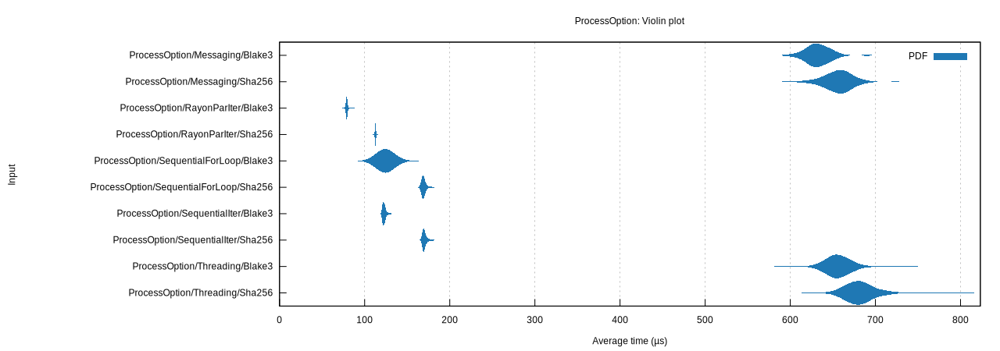

# About

File hash checker represents a minimal solution meeting the following
requirements:

* Calculate the SHA256 or BLAKE3 hashes of one or more files in sequence (for
  loop, iterator) or parallel (threading, messaging, [`rayon`] parallel
  iterator)
* Provide library API
* Benchmarks via [`criterion`]
* Minimal dependencies: [`blake3`], [`sha2`], [`anyhow`], [`clap`], [`rayon`]
* Provide a CLI utiility:
    * Simpler and more straightforward usage than `sha256sum`, `b3sum`
    * Save the hash to an adjacent hash file (if it doesn't already exist)
      (`.sha256`, `.b3`)
    * Compare the current hash to an adjacent hash file (if it exists)

[`anyhow`]: https://crates.io/crates/anyhow
[`blake3`]: https://crates.io/crates/blake3
[`clap`]: https://crates.io/crates/clap
[`criterion`]: https://crates.io/crates/criterion
[`sha2`]: https://crates.io/crates/sha2
[`rayon`]: https://crates.io/crates/rayon

# Usage

```
$ fhc -h
!run:../target/release/fhc -h
```

```
$ fhc -V
!run:../target/release/fhc -V
```

# Example

1. Run `fhc` against one or more files to calculate and print the SHA256 or
   BLAKE3 hash for each file to stdout and save in adjacent hash files.
2. At any later point, run `fhc` against one or more files with adjacent
   hash files to re-calculate the hash for each file and report `OK` if the
   hashes match and `FAILED` if the hashes do not match.

# Benchmark




!inc:../CHANGELOG.md

